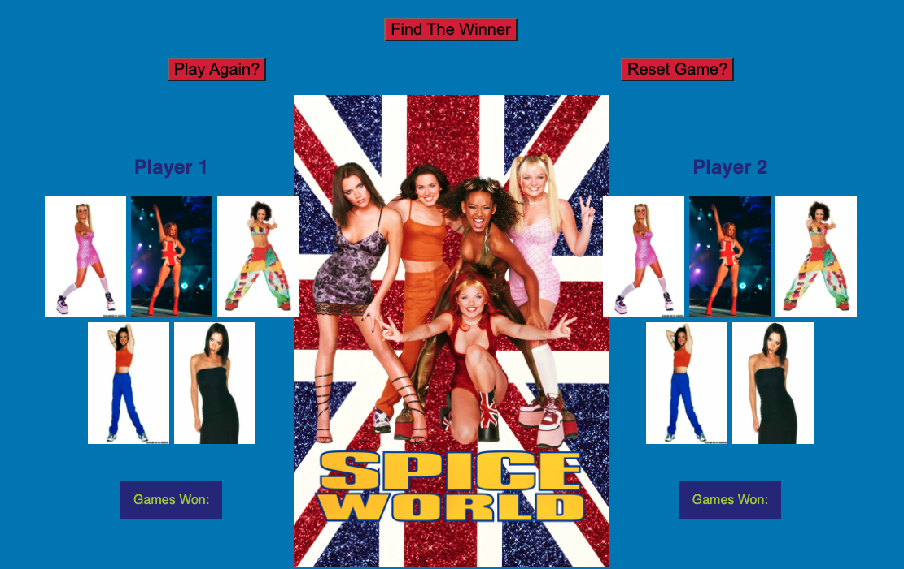

# [Roshambo Js](https://roshambo-js-mandywade.netlify.app/)

The objective of this project was to create a classic Rock, Paper, Scissors game but add a twist and throw in Lizard and Spock as well. I took the game a step further and changed it from Rock, Paper, Scissors, Lizard, Spock to Posh, Baby, Ginger, Scary, and Sporty.

This tribute to the Spice Girls used the following technologies:

- [JavaScript](https://developer.mozilla.org/en-US/docs/Web/JavaScript)
- [DOM](https://developer.mozilla.org/en-US/docs/Web/API/Document_Object_Model/Introduction)
